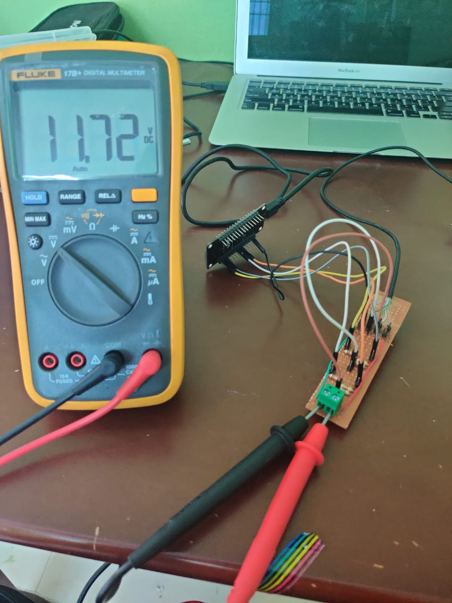

# QuickCharge/FastCharge 18W chargers/Powerbanks hack

Most latest USB chargers/Powerbanks that are provided/bought with smartphones, are enabled for fast charge or quick charge (terms change according to brand). Majority of these chargers/powerbanks have variable Voltage output - 5 volts, 9 volts and 12 volts(and sometimes 20 volts too!). But these seem to only work when a smartphone is connect, i.e. when a stripped USB cable is attached and voltage is measured, the maximum output is 5 volts. This experiment was done to learn and mod an existing charger/powerbank to use as an reliable 9v or 12v power source.

## How it works : 
The higher voltage levels are triggered, by providing variable voltage levels to the data lines on the USB. By default the output is 5 volts. If a smartphones needs to be fast charged, the phone provides a variable level of voltage to the charger, telling the charger to give it a higher voltage. The common standard levels are as follows :
Data +  | Data -    | Output
--------|-----------|-------
0.6v    | GND       | 5v
3.3v    | 0.6v      | 9v
0.6v    | 0.6v      | 12v
3.3v    | 3.3v      | 20V (not common)

The above table is Qualcomm's QuickCharge2.0 standard. Watch this amazing video by Andrew spiess for a detailed explaination of this protocol.
[#244 QC3.0 Hacking and Tutorial incl. QC2.0 (Mobile Power Supply) Quick charge with Arduino](https://www.youtube.com/watch?v=dw3MehLAyWU)

I've tested out with Mi 18W fast charger and Motorola Turbo Charger. It should work with any 18W fast charger. Check before buying. 
Some fast chargers such as the OnePlus Warp Charger does not support this. Its only 5v at 6amps.

## Things required : 
- A microcontroller with 3.3 level logic - I've used a nodeMCU, but if you change the resistor values in the voltage divider circuit, any 5v uControllers can be used
- 2x 10k Ohm resistors 
- 4x 2.2K Ohm resistors 
- Stripped USB cable with USB Type-A Male connector
- Jumpers, breadboard, headers as required

## Circuit and Pictures:
<!--  -->
<!-- 

 -->

## Things to do : 
- [x] build a protoype circuit and check if theory is working
- [ ] Try out different brands of chargers, atleast 3
** Mi 18W fast Charger - tested and all three levels working
** Motorola fast charger - tested and all three levels working
- [ ] Try a regular 18w power bank
- [ ] Try a QC 3.0 charger and powerbank
- [ ] test out a smaller microcontroller(attiny45/85) and build a circuit with built-in voltage regulator for the uController
- [ ] Design a PCB